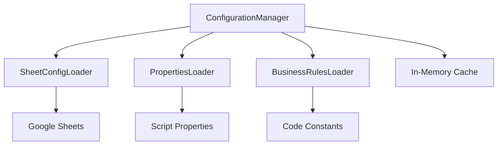
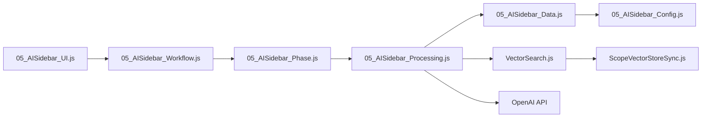
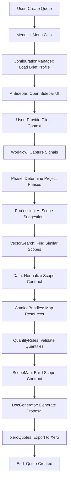
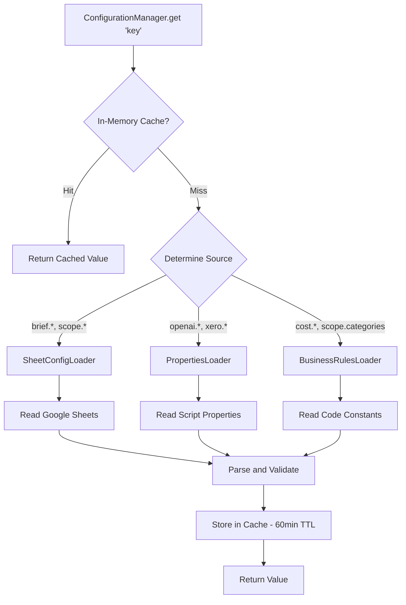
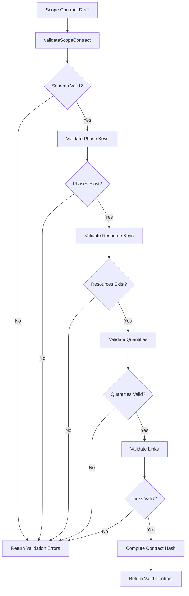
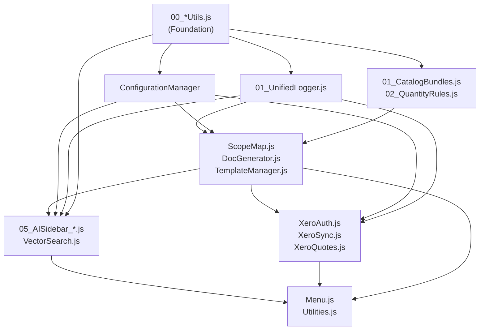

# Fresh CP - System Architecture

**Technical architecture reference for Fresh CP Quote & Proposal Builder**

This document describes the internal system design, component relationships, data transformations, and architectural patterns used in Fresh CP. It's intended for developers who need to understand how the system works internally.

For a high-level system overview, see [README.md](README.md).

---

## Table of Contents

- [Architecture Overview](#architecture-overview)
  - [Three-Tier Architecture](#three-tier-architecture)
  - [System Design Principles](#system-design-principles)
- [Component Layers](#component-layers)
  - [Layer 0: Shared Utilities (00_*)](#layer-0-shared-utilities-00_)
  - [Layer 1: Core Business Logic (01_*, 02_*)](#layer-1-core-business-logic-01_-02_)
  - [Layer 2: Configuration System](#layer-2-configuration-system)
  - [Layer 3: AI/Processing](#layer-3-aiprocessing)
  - [Layer 4: Integration & UI](#layer-4-integration--ui)
- [Data Flow](#data-flow)
  - [Quote Generation Flow](#quote-generation-flow)
  - [Configuration Loading Flow](#configuration-loading-flow)
  - [Scope Validation Flow](#scope-validation-flow)
- [Module Dependencies](#module-dependencies)
  - [Load Order](#load-order)
  - [Dependency Graph](#dependency-graph)
  - [Circular Dependency Prevention](#circular-dependency-prevention)
- [Key Design Patterns](#key-design-patterns)
  - [Single Source of Truth](#single-source-of-truth)
  - [Separation of Concerns](#separation-of-concerns)
  - [Centralized Logging](#centralized-logging)
  - [Error Handling](#error-handling)
- [Service Integration Points](#service-integration-points)
  - [Google Sheets API](#google-sheets-api)
  - [OpenAI API](#openai-api)
  - [Xero API](#xero-api)
  - [Vector Store](#vector-store)
- [State Management](#state-management)
  - [Configuration Caching](#configuration-caching)
  - [Session State](#session-state)
  - [Data Persistence](#data-persistence)

---

## Architecture Overview

### Three-Tier Architecture

Fresh CP follows a layered architecture pattern with clear separation between utilities, business logic, and presentation:

```
┌─────────────────────────────────────────────────────────┐
│                      Layer 4: UI                        │
│   Menu.js, Utilities.js, Validation.js                  │
│   (User entry points, UI triggers)                      │
└────────────────────────┬────────────────────────────────┘
                         │
┌────────────────────────▼────────────────────────────────┐
│               Layer 3: Integration & AI                 │
│   XeroAuth, XeroSync, XeroQuotes, XeroContacts          │
│   AISidebar (6 modules), VectorSearch                   │
│   (External APIs, AI processing)                        │
└────────────────────────┬────────────────────────────────┘
                         │
┌────────────────────────▼────────────────────────────────┐
│            Layer 2: Domain Services                     │
│   ScopeMap, DocGenerator, TemplateManager               │
│   ItemLookup, ResourceLookup, NormalizeData             │
│   (Core business logic)                                 │
└────────────────────────┬────────────────────────────────┘
                         │
┌────────────────────────▼────────────────────────────────┐
│       Layer 1: Configuration & Core Business Logic      │
│   ConfigurationManager, CatalogBundles, QuantityRules   │
│   (Configuration, validation, core rules)               │
└────────────────────────┬────────────────────────────────┘
                         │
┌────────────────────────▼────────────────────────────────┐
│            Layer 0: Shared Utilities (00_*)             │
│   ErrorUtils, JsonUtils, ArrayUtils, StringUtils        │
│   ValidationUtils, NormalizationUtils                   │
│   UnifiedLogger, PerformanceMonitor, PropertiesCache    │
│   (Foundation - no dependencies)                        │
└─────────────────────────────────────────────────────────┘
```

**Key Characteristics:**
- **Bottom-Up Dependencies**: Lower layers don't depend on higher layers (utilities don't call business logic)
- **File Naming**: Numeric prefixes enforce load order (00_ → 01_ → 02_ → 05_ → no prefix)
- **Clear Boundaries**: Each layer has specific responsibilities and exports a clean API
- **Google Apps Script Runtime**: ES5 compatible, V8 engine, server-side JavaScript

### System Design Principles

**1. Single Source of Truth**
- **ConfigurationManager** - All configuration access
- **00_*Utils.js** - All common utilities
- **UnifiedLogger** - All logging operations

**2. Fail-Safe Defaults**
- Graceful degradation when APIs unavailable
- Fallback values for configuration
- Safe defaults in error handlers

**3. Caching Strategy**
- Multi-layer caching (in-memory → PropertiesService → source)
- 60-minute TTL for configuration
- 20-40x performance improvement for properties

**4. Load Order Enforcement**
- Numeric prefixes guarantee loading sequence
- Dependencies loaded before dependents
- Prevents circular dependencies

**5. Separation of Concerns**
- Utilities: Pure functions, no business logic
- Business Logic: Domain rules, transformations
- UI: Presentation, user interaction only

[↑ Back to Top](#fresh-cp---system-architecture)

---

## Component Layers

### Layer 0: Shared Utilities (00_*)

**Purpose**: Foundation layer providing common utilities used by all other layers.

**Load Priority**: First (00_ prefix)

**Key Modules**:

**00_NormalizationUtils.js** (8 functions)
- `normalizeKey(str)` - Convert strings to lowercase keys
- `normalizePhase(str)` - Normalize phase names
- `normalizeCategory(str)` - Normalize category strings
- `normalizeScope(str)` - Normalize scope identifiers
- `normalizeItemName(str)` - Normalize item/resource names
- `normalizeSku(str)` - Normalize SKU codes
- `normalizeJson(obj)` - Normalize JSON objects
- `normalizeArray(arr)` - Normalize arrays

**00_JsonUtils.js** (9 functions)
- `parseJsonSafe(str, fallback)` - Safe JSON parsing with fallback
- `stringifyPretty(obj)` - Pretty-print JSON
- `deepClone(obj)` - Deep clone objects
- `mergeObjects(target, source)` - Deep merge
- Plus: compact, flatten, unflatten, pick, omit

**00_ArrayUtils.js** (8 functions)
- `unique(arr)` - Remove duplicates
- `groupBy(arr, key)` - Group array by property
- `chunk(arr, size)` - Split into chunks
- `flatten(arr)` - Flatten nested arrays
- Plus: partition, intersection, difference, zip

**00_ValidationUtils.js** (10 functions)
- `isValidEmail(str)` - Email validation
- `isValidUrl(str)` - URL validation
- `isValidDate(str)` - Date validation
- `isEmpty(val)` - Empty check
- Plus: isNumeric, isObject, isArray, hasProperty, validateRequired, validateRange

**00_StringUtils.js** (8 functions)
- `truncate(str, length)` - Truncate with ellipsis
- `capitalize(str)` - Capitalize first letter
- `camelCase(str)` - Convert to camelCase
- `slugify(str)` - Create URL-safe slugs
- Plus: pad, repeat, removeWhitespace, escapeHtml

**00_ErrorUtils.js** (13 functions)
- `createError(message, category, context)` - Structured errors
- `catchAndLog(fn, category)` - Automatic error handling
- `retryWithBackoff(fn, maxRetries)` - Retry mechanism
- Plus: isError, getErrorMessage, logError, throwError, etc.

**00_PerformanceMonitor.js**
- Lightweight performance tracking
- Execution time measurement
- Resource usage monitoring

**00_PropertiesCache.js**
- Property value caching (20-40x speedup)
- 60-minute TTL
- Automatic cache invalidation

**Dependencies**: None (foundation layer)

**Used By**: All other layers

**Example Usage**:
```javascript
// Safe JSON parsing
const data = parseJsonSafe(jsonString, {});

// Array operations
const grouped = groupBy(items, 'category');
const unique = unique(ids);

// Validation
if (isValidEmail(email)) {
  // Process email
}

// Error handling
catchAndLog(function() {
  const result = complexOperation();
  UnifiedLogger.info('Category', 'Operation complete', {result});
}, 'Category');
```

### Layer 1: Core Business Logic (01_*, 02_*)

**Purpose**: Core business rules, validation, and resource management.

**Load Priority**: Second (01_, 02_ prefixes)

**Key Modules**:

**01_UnifiedLogger.js**
- Centralized logging with correlation IDs
- Log levels: verbose, info, warn, error
- Automatic context capture
- Spreadsheet logging for audit trail

**01_CatalogBundles.js**
- Pre-configured resource packages
- Bundle creation and management
- Resource grouping by category
- Automatic quantity calculation

**02_QuantityRules.js**
- Quantity validation by phase
- Min/max quantity enforcement
- Phase-specific rules
- Scope entry validation

**02_TraceLogger.js**
- Operation tracing
- Call stack tracking
- Performance profiling

**Dependencies**: Layer 0 utilities

**Used By**: Domain services, integrations, UI

**Example Usage**:
```javascript
// Logging
UnifiedLogger.info('ScopeMap', 'Building scope contract', {
  phaseCount: phases.length,
  resourceCount: resources.length
});

// Catalog bundles
const bundle = getBundleByName('User Authentication Bundle');
const resources = bundle.resources; // [{sku, name, quantity}, ...]

// Quantity validation
const isValid = validateQuantityForPhase('Build', 'Frontend Dev', 40);
```

### Layer 2: Configuration System

**Purpose**: Unified configuration management with three sources: Script Properties, Google Sheets, and Business Rules.

**Architecture**:



**Key Modules**:

**ConfigurationManager.js** (Central coordinator)
- `get(key)` - Get configuration value
- `has(key)` - Check if config exists
- `invalidate(key)` - Clear cache for key
- `validateAll()` - Validate all configuration

**SheetConfigLoader.js** (Google Sheets data)
- Loads: Brief profiles, scope phases, catalog bundles
- Sheet-driven configuration
- JSON parsing and validation
- 60-minute cache TTL

**PropertiesLoader.js** (Secrets and credentials)
- Loads: API keys (OpenAI, Xero)
- Script Properties access
- Secure credential storage
- No logging of secrets

**BusinessRulesLoader.js** (Code constants)
- Loads: Fee percentages, cost multipliers, scope categories
- Business rules in code
- Type-safe constants
- Version controlled

**Configuration Hierarchy**:

1. **Script Properties** (Highest Priority - Secrets)
   - `openai.apiKey` - OpenAI API key
   - `xero.clientId` - Xero OAuth client ID
   - `xero.clientSecret` - Xero OAuth secret

2. **Google Sheets** (Business Data)
   - `brief.profiles` - Quote templates
   - `scope.phases` - Project phases
   - `catalog.bundles` - Resource bundles

3. **Business Rules** (Code Constants)
   - `cost.feePercentage` - Fee calculation (e.g., 0.15 = 15%)
   - `cost.markup` - Cost markup multiplier
   - `scope.categories` - Valid scope categories

**Dependencies**: Layer 0 utilities, Layer 1 logging

**Used By**: All layers

**Example Usage**:
```javascript
// Get configuration
const profiles = ConfigurationManager.get('brief.profiles');
const feePercent = ConfigurationManager.get('cost.feePercentage');
const apiKey = ConfigurationManager.get('openai.apiKey');

// Check existence
if (ConfigurationManager.has('xero.clientId')) {
  // Xero is configured
}

// Cache management
ConfigurationManager.invalidate('brief.profiles'); // Force reload
```

### Layer 3: AI/Processing

**Purpose**: AI-powered scope generation, semantic search, and OpenAI integration.

**Architecture**:

The AI layer is split into 6 specialized modules (established in Phase 3):

**05_AISidebar_Config.js** - Configuration, schemas, taxonomy
- Workflow schemas
- Phase taxonomy
- Signal definitions
- Validation rules

**05_AISidebar_Phase.js** - Phase guidance, evidence scanning
- Phase templates
- Evidence detection
- Requirement extraction
- Phase progression logic

**05_AISidebar_Workflow.js** - Workflow signal processing
- Signal capture from user inputs
- Context building
- Signal merging with brief profiles
- Workflow state management

**05_AISidebar_Data.js** - Data normalization, validation
- Scope contract normalization
- Data validation
- Schema enforcement
- Error detection

**05_AISidebar_Processing.js** - AI/OpenAI integration, catalog mapping
- OpenAI API calls
- Prompt engineering
- Response parsing
- Catalog mapping from AI suggestions

**05_AISidebar_UI.js** - Sidebar UI, HTML, state management
- HTML sidebar generation
- User interaction handling
- State persistence
- UI event handling

**Supporting Modules**:

**VectorSearch.js** - Semantic search using embeddings
- OpenAI embeddings API
- Vector similarity search
- Scope matching
- Similar project recommendations

**ScopeVectorStoreSync.js** - Vector store integration
- Scope indexing
- Embedding generation
- Vector store updates
- Batch processing

**Module Interaction Flow**:



**Dependencies**: Layers 0-2 (utilities, business logic, configuration)

**Used By**: Layer 4 (UI)

**Example Usage**:
```javascript
// Show AI Sidebar
showAISidebar(); // Entry point in 05_AISidebar_UI.js

// Process workflow signals (internal)
const signals = captureWorkflowSignals(userInputs);
const mergedContext = mergeSignalsWithProfile(signals, profile);

// AI processing (internal)
const scopeSuggestions = processBriefWithOpenAI(brief, context);
const mappedResources = catalogMapper(scopeSuggestions);

// Vector search (internal)
const similarScopes = searchVectorStore(embedding, topK);
```

### Layer 4: Integration & UI

**Purpose**: User interface, external API integrations, and system entry points.

**UI Entry Points**:

**Menu.js** - Custom Google Sheets menu
- Three-stage initialization (deferred loading)
- Menu items for all major operations
- User action triggers
- Function delegation to services

**Utilities.js** - UI helper functions
- Data formatting
- Sanitization
- Display utilities
- Cell formatting

**Validation.js** - Input validation
- Form validation
- Data integrity checks
- User input sanitization

**External Integrations**:

**Xero Integration** (Financial API):

**XeroAuth.js** - OAuth2 authentication
- OAuth2 flow implementation
- Token management
- Refresh token handling
- Authorization state

**XeroSync_Enhanced.js** - Inventory synchronization
- Batch operations for efficiency
- Rate limiting (Xero API constraints)
- Inventory item sync
- Conflict resolution

**XeroContacts.js** - Contact management
- Contact creation
- Contact lookup
- Contact updates
- Deduplication

**XeroQuotes.js** - Quote export
- Quote creation in Xero
- Line item mapping
- Tax calculation
- PDF attachment

**XeroInventory.js** - Inventory queries
- Item lookup by SKU
- Inventory status checks
- Price retrieval

**Supporting Services**:

**RateLimiter.js** - API throttling
- Xero rate limit compliance (5 req/sec)
- OpenAI rate limit handling
- Exponential backoff
- Request queuing

**TemplateManager.js** - Document templates
- Template loading
- Placeholder replacement
- Document generation
- Format conversion

**DocGenerator.js** - Proposal generation
- Client view (external proposal)
- Internal view (detailed breakdown)
- Google Docs creation
- PDF export

**Dependencies**: All lower layers

**Used By**: End users via Google Sheets UI

**Example Usage**:
```javascript
// Menu usage (user clicks menu item)
// Menu.js:onOpen() → creates custom menu
// User clicks "Create Quote" → delegates to AISidebar

// Xero integration
const authorized = authorizeXero(); // OAuth flow
syncInventoryToXero(); // Batch sync
const quoteId = exportQuoteToXero(scopeData); // Export

// Document generation
const clientDoc = generateClientView(scope);
const internalDoc = generateInternalView(scope, costBreakdown);
```

[↑ Back to Top](#fresh-cp---system-architecture)

---

## Data Flow

### Quote Generation Flow

**End-to-End Quote Generation Process**:



**Detailed Steps**:

1. **User Initiation** (`Menu.js`)
   - User clicks "Fresh CP" → "Create Quote" in Google Sheets menu
   - Menu.js delegates to AISidebar

2. **Configuration Loading** (`ConfigurationManager`)
   - Load brief profile from Google Sheets
   - Merge with workflow signals
   - Cache configuration (60min TTL)

3. **AI Sidebar** (`05_AISidebar_UI.js`)
   - Display HTML sidebar
   - Present brief profile options
   - Capture client details (name, industry, project type)

4. **Workflow Signals** (`05_AISidebar_Workflow.js`)
   - Capture: Client name, industry, project requirements
   - Merge: Brief profile defaults + user inputs
   - Build: Complete context for AI processing

5. **Phase Determination** (`05_AISidebar_Phase.js`)
   - Analyze project requirements
   - Select phases: Discovery, Planning, Build, Deploy, Support
   - Determine phase sequence and dependencies

6. **AI Processing** (`05_AISidebar_Processing.js`)
   - Send brief + context to OpenAI API
   - Receive scope suggestions with resources
   - Parse JSON response

7. **Vector Search** (`VectorSearch.js`)
   - Generate embedding for current scope
   - Search vector store for similar projects
   - Retrieve estimation data from matches

8. **Scope Normalization** (`05_AISidebar_Data.js`)
   - Normalize AI suggestions
   - Validate against schemas
   - Detect data errors

9. **Resource Mapping** (`01_CatalogBundles.js`)
   - Map AI suggestions to catalog items
   - Apply catalog bundles
   - Calculate resource quantities

10. **Quantity Validation** (`02_QuantityRules.js`)
    - Validate quantities per phase
    - Check min/max constraints
    - Enforce business rules

11. **Scope Contract** (`ScopeMap.js`)
    - Build structured scope contract
    - Link resources to phases
    - Compute contract hash for integrity

12. **Cost Calculation** (`BusinessRulesLoader` + calculation logic)
    - Apply fee percentage (e.g., 15%)
    - Apply markup multipliers
    - Calculate totals

13. **Proposal Generation** (`DocGenerator.js`)
    - Generate client view (external)
    - Generate internal view (detailed)
    - Create Google Docs

14. **Xero Export** (`XeroQuotes.js`) (Optional)
    - Authenticate with Xero OAuth
    - Create quote in Xero
    - Attach line items
    - Return Xero quote ID

**Data Transformations**:

```
User Input (Raw)
    ↓ (normalizeKey, normalizeCategory)
Normalized Signals
    ↓ (mergeSignalsWithProfile)
Complete Context
    ↓ (processBriefWithOpenAI)
AI Suggestions (JSON)
    ↓ (catalogMapper)
Mapped Resources
    ↓ (validateQuantityForPhase)
Validated Resources
    ↓ (buildScopeMapFromDraft)
Scope Contract
    ↓ (calculateCosts)
Quote with Costs
    ↓ (generateClientView)
Proposal Document
    ↓ (exportQuoteToXero)
Xero Quote
```

### Configuration Loading Flow

**Multi-Layer Configuration Loading**:



**Caching Strategy**:

**Layer 1: In-Memory Cache** (ConfigurationManager)
- Fastest access
- TTL: 60 minutes
- Cleared on invalidate()

**Layer 2: PropertiesCache** (00_PropertiesCache.js)
- PropertiesService storage
- 20-40x faster than direct property access
- TTL: 60 minutes

**Layer 3: Source** (Google Sheets, Script Properties, Code)
- Slowest (network/disk access)
- Always fresh data
- Accessed on cache miss

**Configuration Load Times**:
- **Cache Hit**: ~1-5ms (in-memory)
- **PropertiesCache Hit**: ~10-20ms (PropertiesService)
- **Cache Miss**: ~100-500ms (Google Sheets API)
- **Cold Start**: ~500-1000ms (first load)

**Example Configuration Key Resolution**:

```javascript
// Key: "brief.profiles"
// Source: Google Sheets (SheetConfigLoader)
// Cache: In-memory (ConfigurationManager)
// TTL: 60 minutes

ConfigurationManager.get('brief.profiles')
  → Check in-memory cache (miss)
  → Delegate to SheetConfigLoader
  → Read "Brief Profiles" sheet
  → Parse rows to JSON
  → Validate schema
  → Store in cache
  → Return [{name: "Standard Web App", ...}, ...]
```

### Scope Validation Flow

**Contract Validation Process**:



**Validation Steps**:

1. **Schema Validation** (`05_AISidebar_Data.js`)
   - Required fields present
   - Data types correct
   - Structure matches schema

2. **Phase Validation** (`02_QuantityRules.js`)
   - Phase keys normalized
   - Phases exist in system
   - Phase order valid

3. **Resource Validation** (`ItemLookup.js`, `ResourceLookup.js`)
   - SKUs exist in catalog
   - Resource names valid
   - Categories correct

4. **Quantity Validation** (`02_QuantityRules.js`)
   - Quantities within min/max bounds
   - Phase-specific quantity rules
   - Total quantities reasonable

5. **Link Validation** (`ScopeMap.js`)
   - Resources linked to phases
   - Links reference existing entries
   - No orphaned resources

6. **Hash Computation** (`ScopeMap.js`)
   - Compute scope contract hash
   - Detect contract modifications
   - Integrity verification

**Validation Result**:

```javascript
// Valid contract
{
  valid: true,
  contract: { /* scope contract */ },
  hash: "abc123def456",
  errors: []
}

// Invalid contract
{
  valid: false,
  contract: null,
  hash: null,
  errors: [
    {field: "phases.0.resources.0.quantity", message: "Quantity exceeds max for phase Build"},
    {field: "resources.5.sku", message: "SKU 'XYZ-999' not found in catalog"}
  ]
}
```

[↑ Back to Top](#fresh-cp---system-architecture)

---

## Module Dependencies

### Load Order

**Google Apps Script Load Sequence** (controlled by file naming):

```
Phase 1: Foundation (00_* prefix)
├─ 00_ErrorUtils.js
├─ 00_JsonUtils.js
├─ 00_ArrayUtils.js
├─ 00_ValidationUtils.js
├─ 00_StringUtils.js
├─ 00_NormalizationUtils.js
├─ 00_PropertiesCache.js
├─ 00_PerformanceMonitor.js
└─ 00_Profiler.js

Phase 2: Core Infrastructure (01_* prefix)
├─ 01_UnifiedLogger.js
└─ 01_CatalogBundles.js

Phase 3: Business Rules (02_* prefix)
├─ 02_QuantityRules.js
└─ 02_TraceLogger.js

Phase 4: AISidebar (05_* prefix)
├─ 05_AISidebar_Config.js
├─ 05_AISidebar_Phase.js
├─ 05_AISidebar_Workflow.js
├─ 05_AISidebar_Data.js
├─ 05_AISidebar_Processing.js
└─ 05_AISidebar_UI.js

Phase 5: Configuration (alphabetical)
├─ BusinessRulesLoader.js
├─ Config.js
├─ ConfigurationManager.js
├─ ConfigSeeder.js
├─ ConfigValidator.js
├─ PropertiesLoader.js
└─ SheetConfigLoader.js

Phase 6: Domain Services (alphabetical)
├─ DocGenerator.js
├─ ItemLookup.js
├─ Menu.js
├─ NormalizeData.js
├─ ResourceLookup.js
├─ ScopeMap.js
├─ ScopeSheetManager.js
└─ TemplateManager.js

Phase 7: Integrations (alphabetical)
├─ RateLimiter.js
├─ VectorSearch.js
├─ ScopeVectorStoreSync.js
├─ XeroAuth.js
├─ XeroContacts.js
├─ XeroInventory.js
├─ XeroQuotes.js
└─ XeroSync_Enhanced.js

Phase 8: UI & Entry Points (alphabetical)
├─ Utilities.js
└─ Validation.js
```

**Why Load Order Matters**:

1. **Foundation First**: Utilities must load before they're used
2. **Configuration Early**: ConfigurationManager needed by most modules
3. **Business Logic Middle**: Domain services depend on utilities and config
4. **UI Last**: Entry points use all other layers

### Dependency Graph

**Visual Dependency Relationships**:



**Module Dependency Rules**:

1. **Utilities (00_*)**: No dependencies (except Google Apps Script built-ins)
2. **Core (01_*, 02_*)**: Depends on utilities only
3. **Configuration**: Depends on utilities and logging
4. **Domain Services**: Depends on utilities, logging, config, core
5. **AI/Processing**: Depends on all lower layers
6. **Integrations**: Depends on utilities, logging, config, domain
7. **UI**: Depends on all layers

**Dependency Count by Layer**:

```
Layer 0 (Utilities):       0 dependencies
Layer 1 (Core):            1-2 dependencies (utilities)
Layer 2 (Configuration):   2-3 dependencies (utilities, logging)
Layer 3 (Domain):          3-5 dependencies (utilities, logging, config, core)
Layer 4 (AI/Processing):   5-10 dependencies (all lower layers)
Layer 5 (Integration):     3-7 dependencies (utilities, logging, config, domain)
Layer 6 (UI):              10+ dependencies (all layers)
```

### Circular Dependency Prevention

**Strategies Used**:

1. **Strict Layering**
   - Lower layers never import higher layers
   - Utilities don't depend on business logic
   - Business logic doesn't depend on UI

2. **File Naming Enforcement**
   - Numeric prefixes control load order
   - Apps Script loads files alphabetically
   - Dependencies guaranteed to load first

3. **Single Entry Points**
   - ConfigurationManager: All config access
   - UnifiedLogger: All logging
   - Prevents multiple import paths

4. **Dependency Injection (where needed)**
   - Pass dependencies as function parameters
   - Avoid global state where possible
   - Explicit dependencies in function signatures

**Examples of Prevented Circular Dependencies**:

❌ **Bad** (would create circular dependency):
```javascript
// 00_ErrorUtils.js
function logError(message) {
  UnifiedLogger.error('ErrorUtils', message); // UnifiedLogger loads AFTER ErrorUtils!
}
```

✅ **Good** (layered approach):
```javascript
// 00_ErrorUtils.js
function createError(message, category, context) {
  return {
    message: message,
    category: category,
    context: context,
    timestamp: new Date()
  };
}

// 01_UnifiedLogger.js (loads after ErrorUtils)
function logError(error) {
  if (isError(error)) { // isError from 00_ErrorUtils
    log('ERROR', error.category, error.message, error.context);
  }
}
```

[↑ Back to Top](#fresh-cp---system-architecture)

---

## Key Design Patterns

### Single Source of Truth

**Pattern**: Centralize related functionality in one canonical location to eliminate duplication and inconsistency.

**Implementations**:

**1. ConfigurationManager** (Phase 5)

**Problem**: 8 different configuration systems scattered across codebase
- `Config.js`, `ConfigLoader.js`, `CostCalculationConfig.js`, etc.
- No single entry point
- Unclear ownership (who owns what config?)

**Solution**: Single `ConfigurationManager` coordinating 3 loaders

```javascript
// Single entry point for ALL configuration
ConfigurationManager.get('brief.profiles');     // Google Sheets
ConfigurationManager.get('openai.apiKey');      // Script Properties
ConfigurationManager.get('cost.feePercentage'); // Business Rules

// Clear ownership documented
// - SheetConfigLoader: brief.*, scope.*
// - PropertiesLoader: openai.*, xero.*
// - BusinessRulesLoader: cost.*, scope.categories
```

**Benefits**:
- One function call for all config: `ConfigurationManager.get(key)`
- Clear ownership by source
- Centralized caching
- Single validation point

**2. 00_*Utils.js Modules** (Phase 6)

**Problem**: Duplicate utility functions across files
- Multiple implementations of `normalizeKey()`, `parseJsonSafe()`, etc.
- Inconsistent behavior
- Bug fixes required in multiple places

**Solution**: Canonical utility modules

```javascript
// 00_NormalizationUtils.js - 8 canonical functions
normalizeKey(str);
normalizePhase(str);
normalizeCategory(str);
// ... etc

// 00_JsonUtils.js - 9 canonical functions
parseJsonSafe(str, fallback);
stringifyPretty(obj);
deepClone(obj);
// ... etc
```

**Benefits**:
- One implementation per utility function
- Consistent behavior across codebase
- Single place to fix bugs
- Thin wrappers for domain-specific variants

**3. UnifiedLogger** (Phase 2)

**Problem**: 200+ console.log/warn calls, no structure
- No correlation IDs
- No context capture
- Difficult to trace request flow

**Solution**: Single UnifiedLogger for all logging

```javascript
// Single logging API
UnifiedLogger.verbose(category, message, context);
UnifiedLogger.info(category, message, context);
UnifiedLogger.warn(category, message, context);
UnifiedLogger.error(category, message, context);

// Automatic correlation ID generation
// Automatic context capture
// Structured spreadsheet logging
```

**Benefits**:
- Consistent log format
- Correlation IDs for tracing
- Centralized log management
- Easy to filter by category

### Separation of Concerns

**Pattern**: Split complex modules into focused, single-responsibility components.

**Implementation: AISidebar Split** (Phase 3)

**Problem**: `AISidebar.js` was 15,169 lines, doing everything
- Configuration + workflow + data + processing + UI in one file
- Difficult to navigate
- High risk of merge conflicts
- Unclear responsibilities

**Solution**: Split into 6 specialized modules

```
AISidebar.js (15,169 lines)
    ↓
├─ 05_AISidebar_Config.js (schemas, taxonomy)
├─ 05_AISidebar_Phase.js (phase guidance)
├─ 05_AISidebar_Workflow.js (signal processing)
├─ 05_AISidebar_Data.js (normalization)
├─ 05_AISidebar_Processing.js (AI integration)
└─ 05_AISidebar_UI.js (sidebar HTML)
```

**Module Responsibilities**:

**Config**: "What data structures and schemas do we use?"
- Workflow schemas
- Phase taxonomy
- Signal definitions

**Phase**: "What phases exist and what do they require?"
- Phase templates
- Evidence scanning
- Requirement extraction

**Workflow**: "What context do we need from the user?"
- Signal capture
- Context building
- Signal merging

**Data**: "Is this data valid and normalized?"
- Normalization
- Validation
- Error detection

**Processing**: "What does the AI say and how do we map it?"
- OpenAI API calls
- Response parsing
- Catalog mapping

**UI**: "How do we show this to the user?"
- HTML generation
- User interaction
- State persistence

**Benefits**:
- Clear boundaries (each module has one job)
- Easier navigation (find config in Config, not Processing)
- Reduced merge conflicts (changes isolated to relevant module)
- Better testability (test each module independently)

### Centralized Logging

**Pattern**: All logging goes through a single, structured system.

**Implementation: UnifiedLogger** (Phase 2)

**Architecture**:

```javascript
// UnifiedLogger.js
function log(level, category, message, context) {
  const correlationId = getOrCreateCorrelationId();
  const timestamp = new Date().toISOString();

  const logEntry = {
    timestamp: timestamp,
    level: level,
    category: category,
    message: message,
    context: context || {},
    correlationId: correlationId
  };

  // Write to console
  console.log(JSON.stringify(logEntry));

  // Write to spreadsheet (async)
  writeToLogSheet(logEntry);
}
```

**Correlation ID Flow**:

```
User Request
    ↓
Generate Correlation ID (uuid)
    ↓
Store in PropertiesService (session-scoped)
    ↓
All log calls in this request get same ID
    ↓
Easy to filter logs: "Show me all logs for request abc-123"
```

**Log Levels**:

- **VERBOSE**: Detailed debugging (disabled in production)
- **INFO**: Important operations (quote created, sync complete)
- **WARN**: Recoverable issues (API timeout, retrying)
- **ERROR**: Failures (API error, validation failed)

**Benefits**:
- Structured logs (JSON format)
- Correlation IDs (trace request flow)
- Context capture (automatic)
- Centralized audit trail (spreadsheet logging)

### Error Handling

**Pattern**: Consistent error creation and handling across the codebase.

**Implementation: 00_ErrorUtils.js** (Phase 6)

**Structured Error Creation**:

```javascript
// Create structured error
function createError(message, category, context) {
  return {
    message: message,
    category: category,
    context: context || {},
    timestamp: new Date(),
    stack: new Error().stack
  };
}

// Usage
const error = createError(
  'Failed to load configuration',
  'ConfigurationManager',
  {key: 'brief.profiles', source: 'SheetConfigLoader'}
);
```

**Automatic Catch-and-Log Wrapper**:

```javascript
// Wrap function with automatic error handling
function catchAndLog(fn, category) {
  try {
    return fn();
  } catch (error) {
    const structuredError = createError(
      error.message || String(error),
      category,
      {originalError: error}
    );

    UnifiedLogger.error(category, structuredError.message, structuredError.context);

    // Rethrow or return default (configurable)
    throw error;
  }
}

// Usage
catchAndLog(function() {
  const data = complexOperation();
  UnifiedLogger.info('Category', 'Operation succeeded', {data: data});
}, 'Category');
```

**Fallback Pattern** (Logging-the-Logger):

```javascript
function safeLog(level, category, message, context) {
  try {
    UnifiedLogger[level](category, message, context);
  } catch (logError) {
    // If logger fails, fall back to console
    console.error('Logger failed:', logError);
    console.error('Original message:', category, message, context);
  }
}
```

**Benefits**:
- Consistent error structure
- Automatic logging
- Fallback to console (logger-can-fail safety)
- Context preservation

[↑ Back to Top](#fresh-cp---system-architecture)

---

## Service Integration Points

### Google Sheets API

**Purpose**: Data storage, configuration, and UI foundation.

**Usage**:

**1. Configuration Sheets**:
- **Brief Profiles** - Quote templates
- **Scope Phases** - Project phases
- **Catalog Bundles** - Resource bundles
- **Resource Catalog** - Item/SKU definitions

**2. Data Sheets**:
- **Quote_Builder** - Quote staging area
- **Scope_Contracts** - Validated scope contracts
- **Log_Sheet** - Audit trail
- **Vector_Index** - Scope embeddings

**3. UI Integration**:
- **Custom Menu** - `Menu.js` creates custom menu items
- **HTML Sidebar** - `05_AISidebar_UI.js` shows HTML sidebar
- **Cell Triggers** - OnEdit, OnChange events

**API Calls**:

```javascript
// SpreadsheetApp (Google Apps Script built-in)
const ss = SpreadsheetApp.getActiveSpreadsheet();
const sheet = ss.getSheetByName('Brief Profiles');
const values = sheet.getRange('A2:D').getValues();

// PropertiesService (for caching)
const props = PropertiesService.getScriptProperties();
props.setProperty('cache:brief.profiles', JSON.stringify(data));
```

**Rate Limits**:
- Read: ~100 calls/100 seconds (Apps Script quota)
- Write: ~50 calls/100 seconds
- Mitigation: Caching (60min TTL)

### OpenAI API

**Purpose**: AI-powered scope generation, semantic search, embeddings.

**Endpoints Used**:

**1. Chat Completions** (`/v1/chat/completions`)
- Model: `gpt-4` or `gpt-3.5-turbo`
- Purpose: Scope generation from briefs
- Input: Brief text + context
- Output: Structured scope contract (JSON)

**2. Embeddings** (`/v1/embeddings`)
- Model: `text-embedding-ada-002`
- Purpose: Semantic search, scope matching
- Input: Scope description
- Output: 1536-dimensional embedding vector

**3. Vector Store** (via Assistants API)
- Purpose: Scope indexing and search
- Operations: Upload, search, update

**API Integration**:

```javascript
// 05_AISidebar_Processing.js
function processBriefWithOpenAI(brief, context) {
  const apiKey = ConfigurationManager.get('openai.apiKey');

  const prompt = buildScopeGenerationPrompt(brief, context);

  const response = UrlFetchApp.fetch('https://api.openai.com/v1/chat/completions', {
    method: 'post',
    headers: {
      'Authorization': 'Bearer ' + apiKey,
      'Content-Type': 'application/json'
    },
    payload: JSON.stringify({
      model: 'gpt-4',
      messages: [
        {role: 'system', content: 'You are a scope generation assistant.'},
        {role: 'user', content: prompt}
      ],
      response_format: {type: 'json_object'}
    })
  });

  const result = JSON.parse(response.getContentText());
  return parseJsonSafe(result.choices[0].message.content, {});
}
```

**Rate Limits**:
- Free tier: 3 requests/minute
- Paid tier: 3500 requests/minute (depending on model)
- Mitigation: RateLimiter.js (exponential backoff)

**Error Handling**:
- API timeout: Retry with backoff
- Rate limit: Wait and retry
- Invalid response: Return fallback

### Xero API

**Purpose**: Financial integration, invoice sync, quote export.

**Endpoints Used**:

**1. OAuth2** (`/oauth2/authorize`, `/oauth2/token`)
- Purpose: Authentication
- Implementation: `XeroAuth.js`
- Token refresh: Automatic

**2. Inventory** (`/api.xro/2.0/Items`)
- Purpose: Sync inventory items, SKU lookup
- Implementation: `XeroSync_Enhanced.js`, `XeroInventory.js`
- Batch operations: Yes (100 items/request)

**3. Contacts** (`/api.xro/2.0/Contacts`)
- Purpose: Client contact management
- Implementation: `XeroContacts.js`
- Operations: Create, update, lookup

**4. Quotes** (`/api.xro/2.0/Quotes`)
- Purpose: Export quotes
- Implementation: `XeroQuotes.js`
- Line items: Mapped from scope contract

**API Integration**:

```javascript
// XeroQuotes.js
function exportQuoteToXero(scopeContract) {
  const accessToken = XeroAuth.getAccessToken(); // OAuth token

  const quoteData = {
    Contact: {ContactID: scopeContract.xeroContactId},
    Date: new Date().toISOString().split('T')[0],
    LineItems: scopeContract.resources.map(function(resource) {
      return {
        Description: resource.name,
        Quantity: resource.quantity,
        UnitAmount: resource.unitCost,
        AccountCode: '200' // Revenue account
      };
    })
  };

  const response = UrlFetchApp.fetch('https://api.xero.com/api.xro/2.0/Quotes', {
    method: 'post',
    headers: {
      'Authorization': 'Bearer ' + accessToken,
      'Content-Type': 'application/json',
      'xero-tenant-id': ConfigurationManager.get('xero.tenantId')
    },
    payload: JSON.stringify(quoteData)
  });

  return JSON.parse(response.getContentText());
}
```

**Rate Limits**:
- 60 requests/minute
- 5000 requests/day
- Mitigation: RateLimiter.js (queue + throttle)

**Error Handling**:
- Token expired: Refresh and retry
- Rate limit: Wait (60 seconds) and retry
- Invalid data: Validate before sending

### Vector Store

**Purpose**: Semantic search for similar scopes and projects.

**Architecture**:

```
Scope Text
    ↓
OpenAI Embeddings API (text-embedding-ada-002)
    ↓
1536-dimensional vector
    ↓
Vector Store (OpenAI Assistants API)
    ↓
Similarity Search (cosine similarity)
    ↓
Similar Scopes
```

**Implementation**:

**VectorSearch.js** - Search interface

```javascript
function searchVectorStore(query, topK) {
  const embedding = generateEmbedding(query);
  const results = queryvectorStore(embedding, topK);
  return results.map(function(result) {
    return {
      scopeId: result.id,
      similarity: result.score,
      scope: result.metadata
    };
  });
}
```

**ScopeVectorStoreSync.js** - Indexing and updates

```javascript
function syncScopeToVectorStore(scopeContract) {
  const scopeText = buildScopeDescription(scopeContract);
  const embedding = generateEmbedding(scopeText);

  uploadToVectorStore({
    id: scopeContract.id,
    embedding: embedding,
    metadata: {
      phases: scopeContract.phases,
      resources: scopeContract.resources,
      totalCost: scopeContract.totalCost
    }
  });
}
```

**Benefits**:
- Find similar projects (estimation data)
- Reuse successful scopes
- Improve AI suggestions (context from similar projects)

[↑ Back to Top](#fresh-cp---system-architecture)

---

## State Management

### Configuration Caching

**Multi-Layer Caching Strategy**:

```
Request for Configuration
    ↓
┌─────────────────────────────────┐
│  Layer 1: In-Memory Cache       │ ← Fastest (1-5ms)
│  (ConfigurationManager)          │
│  TTL: 60 minutes                 │
└────────┬────────────────────────┘
         │ (cache miss)
         ↓
┌─────────────────────────────────┐
│  Layer 2: PropertiesCache       │ ← Fast (10-20ms)
│  (PropertiesService)             │
│  TTL: 60 minutes                 │
└────────┬────────────────────────┘
         │ (cache miss)
         ↓
┌─────────────────────────────────┐
│  Layer 3: Source                │ ← Slow (100-500ms)
│  (Sheets/Properties/Code)        │
│  Always fresh                    │
└─────────────────────────────────┘
```

**Cache Invalidation**:

**Manual** - Explicit invalidation
```javascript
ConfigurationManager.invalidate('brief.profiles');
// Forces reload on next get()
```

**Automatic** - TTL expiration
```javascript
// After 60 minutes, cache entry expires
// Next get() triggers reload
```

**Cold Start** - No cache exists
```javascript
// First request after deployment
// Loads from source, populates all cache layers
```

**Cache Key Strategy**:

```javascript
// Format: "cache:{key}"
// Example: "cache:brief.profiles"

// Storage
PropertiesService.getScriptProperties()
  .setProperty('cache:brief.profiles', JSON.stringify(data));

// Retrieval
const cached = PropertiesService.getScriptProperties()
  .getProperty('cache:brief.profiles');
const data = JSON.parse(cached || '{}');
```

**Performance Impact**:

| Scenario | Load Time | Improvement |
|----------|-----------|-------------|
| Cold Start (no cache) | 500-1000ms | Baseline |
| PropertiesCache Hit | 10-20ms | 25-100x faster |
| In-Memory Cache Hit | 1-5ms | 100-1000x faster |

### Session State

**Use Cases**:

**1. Correlation IDs** (Request Tracing)
```javascript
// Generate once per request
const correlationId = Utilities.getUuid();

// Store for session
PropertiesService.getUserProperties()
  .setProperty('correlationId', correlationId);

// All logs in this session use same ID
UnifiedLogger.info('Category', 'Message', {}); // Auto-includes correlationId
```

**2. UI State** (Sidebar State)
```javascript
// Save sidebar state across interactions
function saveSidebarState(state) {
  const stateJson = JSON.stringify(state);
  PropertiesService.getUserProperties()
    .setProperty('sidebarState', stateJson);
}

// Restore on next open
function restoreSidebarState() {
  const stateJson = PropertiesService.getUserProperties()
    .getProperty('sidebarState');
  return parseJsonSafe(stateJson, {});
}
```

**3. OAuth Tokens** (Xero Authentication)
```javascript
// Store OAuth tokens
function saveXeroTokens(accessToken, refreshToken) {
  const props = PropertiesService.getScriptProperties();
  props.setProperty('xero.accessToken', accessToken);
  props.setProperty('xero.refreshToken', refreshToken);
  props.setProperty('xero.tokenExpiry', String(Date.now() + 1800000)); // 30min
}

// Check if token valid
function isXeroTokenValid() {
  const expiry = Number(PropertiesService.getScriptProperties()
    .getProperty('xero.tokenExpiry') || '0');
  return Date.now() < expiry;
}
```

**State Storage Options**:

| Storage | Scope | Persistence | Use Case |
|---------|-------|-------------|----------|
| Script Properties | Project-wide | Permanent | Secrets, config cache |
| User Properties | Per-user | Permanent | User preferences, session state |
| Document Properties | Per-spreadsheet | Permanent | Document-specific settings |
| Cache Service | Temporary | 6 hours max | Short-term caching |

### Data Persistence

**Primary Storage: Google Sheets**

Fresh CP uses Google Sheets as its database:

**1. Configuration Sheets** (Read-Only)
- Brief Profiles
- Scope Phases
- Catalog Bundles
- Resource Catalog

**2. Operational Sheets** (Read-Write)
- Quote_Builder (active quotes)
- Scope_Contracts (validated contracts)
- Log_Sheet (audit trail)
- Vector_Index (scope embeddings)

**3. Archive Sheets** (Append-Only)
- Completed_Quotes
- Historical_Scopes
- Sync_Log (Xero sync history)

**Data Write Pattern**:

```javascript
// 1. Validate data
const validated = validateScopeContract(draft);

// 2. Write to staging sheet
writeScopeToSheet('Quote_Builder', validated);

// 3. Generate hash for integrity
const hash = computeScopeContractHash(validated);

// 4. Store hash in separate column
sheet.getRange('Z2').setValue(hash);

// 5. On approval: Move to Scope_Contracts sheet
archiveScopeContract(validated);
```

**Data Read Pattern**:

```javascript
// 1. Get sheet
const sheet = SpreadsheetApp.getActiveSpreadsheet()
  .getSheetByName('Brief Profiles');

// 2. Read range (batch read for efficiency)
const values = sheet.getRange('A2:D').getValues();

// 3. Parse rows to objects
const profiles = values
  .filter(function(row) { return row[0]; }) // Non-empty rows
  .map(function(row) {
    return {
      name: row[0],
      description: row[1],
      defaultPhases: parseJsonSafe(row[2], []),
      estimatedHours: Number(row[3]) || 0
    };
  });

// 4. Cache result
ConfigurationManager.cache.set('brief.profiles', profiles);
```

**Benefits of Sheets-as-Database**:
- No external database required
- Built-in UI for data editing
- Version history (Google Sheets revisions)
- Easy export (CSV, Excel)
- Familiar interface for non-developers

**Limitations**:
- Not ACID compliant (no transactions)
- Concurrent write conflicts possible
- Row limit: 10 million cells/sheet
- API quota: ~100 reads/100 seconds

**Mitigation**:
- Optimistic locking (hash-based integrity checks)
- Batch operations (reduce API calls)
- Caching (reduce read load)
- Validation before write (prevent corruption)

[↑ Back to Top](#fresh-cp---system-architecture)

---

**Version:** 1.0.0
**Last Updated:** 2026-01-12
**Phase:** Phase 7 - Documentation

